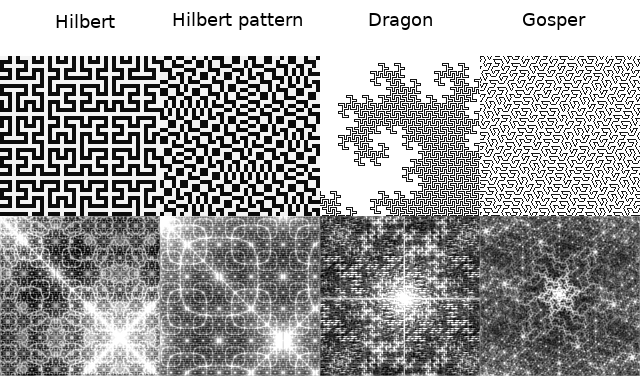

Experiments with plane-filling curves and Fourier transform
===========================================================

A set of visual experiments: applying Fourier transform to various plane-filling curves.



Running
-------

To generate images, run:
```` sh
$ python fft_experiments.py
````
Or just
```` sh
$ make
````

To change parameters, edit the file fft_experiments.py.


Requirements
------------

Python 3, pillow, numpy.


Tests
-----
Some tests are present. Run
```` sh
$ make test
````
to execute them.
